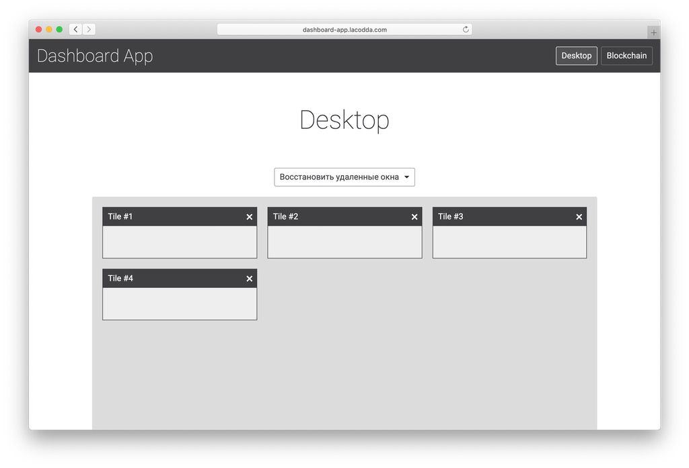
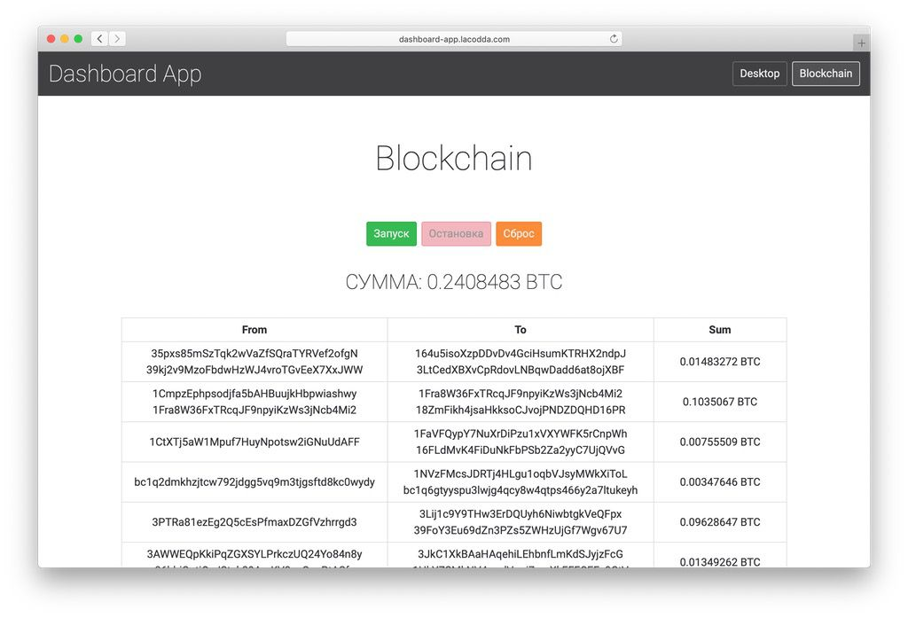

<h1 align="center">Dashboard App</h1>
<p align="center">
  
</p>
<p align="center">
  
</p>
<br>

## Description
Simple control panel application written on framework VueJS 2.x

## Demo
[dashboard-app](http://dashboard-app.lacodda.com)

## Installation
```
npm install
```

### Compiles and hot-reloads for development
```
npm run serve
```

### Compiles and minifies for production
```
npm run build
```

### Lints and fixes files
```
npm run lint
```

## List of used libraries and frameworks

- [vue](https://github.com/vuejs/vue)
- [vuex](https://github.com/vuejs/vuex)
- [vue-router](https://github.com/vuejs/vue-router)
- [vue-native-websocket](https://github.com/nathantsoi/vue-native-websocket)
- [localforage](https://github.com/localForage/localForage)
- [lodash](https://lodash.com/)
- [express](http://expressjs.com/)
- [serve-static](https://github.com/expressjs/serve-static#readme)

## License
[MIT](LICENSE.md)